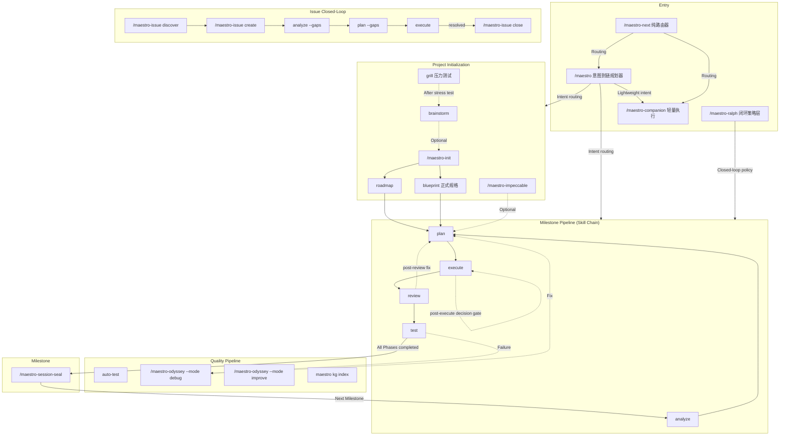
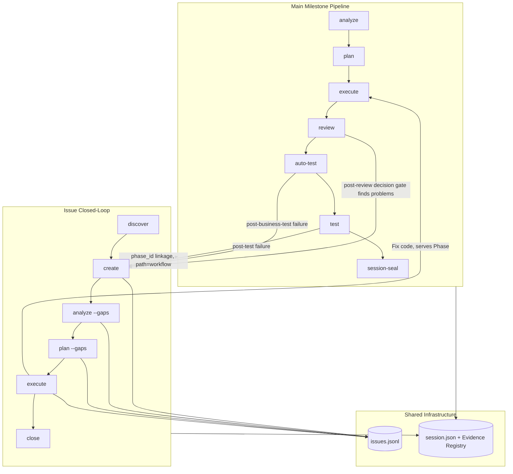

The Maestro command system exposes **18 slash commands**, backed by 45 skills and 80 orchestrator-dispatched steps. This document provides the command panorama and core workflow navigation.

> **v0.5.56 orchestration model**: Maestro and Ralph have merged into the unified **canonical Session/Run chain protocol**. `/maestro` is the **intent-to-chain planner** (intent → initial Skill chain → `maestro session create --chain-file`), `/maestro-ralph` is the **closed-loop policy layer** (Stage Mapping + decision gate + retry/drift/goal-audit). `/maestro-next` is a **pure router** (classify intent → route to companion / single Run / `/maestro`) and is no longer a planner. The old `--engine swarm --script wf-*` syntax has been fully retired.

## Command Overview

| Category | Count | Commands | Responsibility |
|----------|-------|----------|----------------|
| **Core Orchestration** | 6 | `/maestro`, `/maestro-ralph`, `/maestro-next`, `/maestro-companion`, `/maestro-init`, `/maestro-session-seal` | Intent-to-chain planning, closed-loop policy, routing, lightweight execution, project init, Session seal |
| **Issues & Knowledge** | 4 | `/maestro-issue`, `/maestro-knowledge`, `/maestro-knowhow`, `/maestro-learn` | Issue lifecycle and discovery; knowledge-store audit/harvest/wiki/domain; knowhow capture; learning toolkit |
| **Specification** | 1 | `/maestro-spec` | Spec setup, add, load, remove |
| **Deep Cycle & UI** | 2 | `/maestro-odyssey`, `/maestro-impeccable` | Six-mode long-running iteration (debug/improve/planex/review/security/ui); UI design and codify |
| **Worktree** | 2 | `/maestro-fork`, `/maestro-merge` | Create and merge parallel-development worktrees |
| **System** | 3 | `/maestro-update`, `/maestro-overlay`, `/maestro-guard` | Self-update, command overlays, guard rules |

Beyond slash commands there are two other layers, neither invoked with a leading `/`:

- **First-tier steps** (80 in `workflows/`) — `analyze`, `plan`, `execute`, `review`, `test`, `auto-test`, `debug`, `grill`, `brainstorm`, `blueprint`, `roadmap`, `harvest`, `retrospective`, `verify`, `collab` and others. These are dispatched by an orchestrator inside a Session chain; you reach them through `/maestro "<intent>"` or `/maestro-next`, never by typing them as a `/maestro-…` slash command.
- **Skills** (45 in `.claude/skills/`, of which 25 are `team-*`) — user-invocable team and utility skills such as `/team-swarm`.

The global entry point `/maestro` is the **intent-to-chain planner**, which automatically selects the optimal command chain based on user intent and project state, creates a canonical Session, and enters the shared Run loop.

---

## Command Panorama



> The bare command names in the diagram (`analyze`, `plan`, `execute`, `review`, `test`, `brainstorm`, `grill`, `blueprint`, `roadmap`, `auto-test`) are **Skill chain steps**, executed within a canonical Session via `/maestro` routing or `maestro session start --chain ...`; `maestro-*` are standalone slash commands.

---

## Interaction Between Main Pipeline and Issues



### Two Issue Processing Paths

| path | Meaning | Source | Lifecycle |
|------|---------|--------|-----------|
| `standalone` | Independent Issue, not bound to a Phase | Manual creation, `/maestro-issue discover`, external import | Independent closed-loop, does not affect Phase progression |
| `workflow` | Phase-linked Issue | Auto-created by `post-review` / `post-business-test` / `post-test` decision gates, produced by Phase verification | May block milestone completion |

---

## 1. Main Workflow

### Project Initialization

```
/maestro-init → analyze (macro) → roadmap or blueprint (formal specification)
```

| Step | Command | Purpose | Output |
|------|---------|---------|--------|
| 0 | `brainstorm` (optional, via `/maestro "brainstorm..."`) | Multi-role brainstorming | guidance-specification.md |
| 0 | `grill` (optional, via `/maestro "grill..."`) | Adversarial stress test, validate solution assumptions | context-package |
| 1 | `/maestro-init` | Initialize .workflow/ directory | state.json, project.md, specs/ |
| 2 | `analyze "goal"` (macro, via `/maestro`) | Macro analysis — understand impact scope | context.md + scope_verdict |
| 3a | `roadmap` (when scope_verdict=large) | Roadmap | roadmap.md (Milestone > Phase) |
| 3b | `blueprint` (via `/maestro "<specification intent>"`) | Formal specification document (7 stages) | .workflow/blueprint/ |

### Milestone Pipeline

```
analyze → plan → execute → ◆post-execute → review → ◆post-review → test → ◆post-test → session-seal
```

| Stage | Skill Command | Output | Artifact |
|-------|---------------|--------|----------|
| Analyze | `analyze --session {session}` | context.md, analysis.md | ANL-{NNN} |
| Plan | `plan --session {session}` | plan.json + TASK-*.json | PLN-{NNN} |
| Execute | `execute --session {session}` | .summaries/, code changes | EXC-{NNN} |
| Verify | (folded into the `post-execute` decision gate) | verification.json | VRF-{NNN} |
| Review | `review --session {session}` | review.json | REV-{NNN} |
| Test | `test --session {session}` | uat.md, test-results.json | TST-{NNN} |
| Seal | `/maestro-session-seal` | archived to milestones/ | — |

Each `◆` is a **decision node** inserted by the Ralph policy, evaluated by a read-only evaluator that submits a verdict via `maestro session decide --verdict` (see [Ralph Guide](./maestro-ralph-guide.md)).

**Scope routing**: No args = entire milestone; number = specific phase; text = adhoc/standalone. `--from analyze:{id}` / `--from blueprint:{id}` specify the upstream artifact source.

### Five Usage Modes

**A. Full mode**: `/maestro "implement X"` → analyze → plan → execute → review → test (one shot covering all phases)

**B. Per-phase**: `/maestro "analyze phase 1"` → `/maestro "plan phase 1"` → `/maestro "execute phase 1"`

**C. Mixed mode**: Full analysis + per-phase execution + adhoc mid-stream

**D. Unified planning**: analyze 1 → analyze 2 → plan → execute (analyze first, plan once)

**E. Standalone mode**: `analyze-plan-execute` chain (`/maestro "analyze then fix directly"`) — analyze -q → plan --dir → execute --dir, no init/roadmap needed

---

## 2. Quick Channel

```bash
/maestro-next "fix login page bug"        # Pure router: classify intent → route to companion / single Run / /maestro
/maestro-next --list                    # List routable channels
/maestro-next --suggest "refactor API layer"   # Suggest only, do not execute

/maestro-companion "fix README typo"   # Lightweight execution: minimal Run lifecycle (start + done) + evidence recording
/maestro "implement user authentication feature"              # Intent-to-chain: create a canonical Session and execute
/maestro-ralph "refactor auth module"           # Closed-loop policy: full lifecycle chain + decision gate

# CLI direct chain creation (no slash command needed)
maestro session start "fix login chain" --chain analyze plan execute review
maestro session start "understand auth flow" --session 20260721-learn-auth --chain learn --arg "src/auth"
```

> **`/maestro-next` is a pure router**: it classifies intent, evaluates complexity, and routes to the correct execution channel (`/maestro-companion` lightweight / standard single Run / `/maestro` multi-step). It **does not run a loop itself**, nor does it **appear as a step inside a chain**.

---

## 3. Issue Closed-Loop

```
Discover → Create → Analyze → Plan → Execute → Review → Close
```

```bash
/maestro-issue discover by-prompt "check API error handling"
/maestro-issue create --title "memory leak" --severity high
/maestro "fix issue ISS-xxx"            # issue-full chain: analyze --gaps → plan --gaps → execute → review → close → harvest
/maestro-issue close ISS-xxx --resolution "Fixed"
```

The `issue-full` chain (from the `/maestro` chain catalog):

```
analyze --gaps {issue_id} → plan --gaps → execute → review → issue close {issue_id} → harvest --auto
```

`issue-quick` fast path: `plan --gaps → execute → issue close`.

---

## Odyssey Deep Cycle

> Exhaustive iteration command family — three philosophy constraints: **Zero residual** / **Exhaustive iteration** / **Improvement is standard**

Unlike the Quality pipeline (fast gate), Odyssey commands are long-running persistent sessions. Each command has a built-in fix→verify→generalize closed loop that iterates until 0 remaining actionable items before exiting.

```bash
/maestro-odyssey --mode debug "memory leak issue"                    # archaeology→diagnosis→fix→generalize siblings
/maestro-odyssey --mode improve "src/api/"                      # 6-dim audit→round-by-round fix→exhaust all
/maestro-odyssey --mode planex "implement JWT refresh tokens"               # requirement→acceptance criteria→iterate until ALL pass
/maestro-odyssey --mode review "src/auth/"                      # deep review→fix all severities→re-review
/maestro-odyssey --mode security "src/auth/"                    # OWASP Top 10 + STRIDE security audit
/maestro-odyssey --mode ui "src/components/Dashboard"           # visual survey→divergent exploration→exhaustive polish
```

| Command | Focus | Compared to |
|---------|-------|-------------|
| `maestro-odyssey --mode debug` | Deep debug closed loop (with archaeology, generalization) | vs `debug` single step (fast diagnosis) |
| `maestro-odyssey --mode improve` | Runtime quality deep improvement | vs `review` decision gate (pass/fail gate) |
| `maestro-odyssey --mode planex` | Requirement-to-delivery exhaustive iteration | vs `execute` chain step (plan-based execution) |
| `maestro-odyssey --mode review` | Review + fix + generalize full cycle | vs `review` decision gate (verdict only, no fix) |
| `maestro-odyssey --mode security` | Security audit exhaustive iteration | vs a single one-shot audit (no fix loop) |
| `maestro-odyssey --mode ui` | Persistent UI polish session | vs `/maestro-impeccable` (single execution) |

**Shared flags**: `--skip-fix` (analysis only) · `--skip-generalize` (skip generalization) · `-c` (resume session) · `--auto` (automatic mode) · `-y` (auto-confirm)

---

## 4. Quality Pipeline

Quality gates are inserted into the chain by the Ralph policy as **decision nodes** (`post-execute` / `post-business-test` / `post-review` / `post-test` / `post-frontend-verify`), evaluated by a read-only evaluator:

```bash
/maestro-ralph "implement X"     # execute → ◆post-execute → review → ◆post-review → test → ◆post-test → seal
/maestro "comprehensive quality check"      # quality-loop chain: review → auto-test → test → debug → plan --gaps → execute
/maestro "review has problems that need fixing"  # review-fix chain: plan --gaps → execute → review
/maestro-odyssey --mode improve "auth module"  # Technical debt remediation
```

| Command | Purpose | Key Parameters |
|---------|---------|----------------|
| `review --session {session}` | Tiered code review (chain step) | `--tier quick` |
| `auto-test --session {session}` | Business testing / test generation (chain step) | — |
| `test --session {session}` | Session-based UAT (chain step) | `--frontend-verify` |
| `/maestro-odyssey --mode debug` | Hypothesis-driven debugging | `--from-uat {N}` `--parallel` |
| `/maestro-odyssey --mode improve` | Technical debt remediation | `[scope]` |

**Fix loop**: decision gate `fix` verdict → repair Skill produces `chain-proposal/1.0` → insert a repair step (plan --gaps → execute). See [Ralph Guide](./maestro-ralph-guide.md) for details.

---

## 5. Coordinator Command Chains (/maestro Chain Catalog)

```bash
/maestro "implement user authentication module"          # Intent classification → auto-select command chain → create Session
/maestro -y "add OAuth support"        # Auto-confirm low-risk classification and proposal
/maestro -c                          # Continue the only live compatible Session
/maestro --amend "change to support OAuth"    # Amend a live Session goal
/maestro status                      # Project dashboard
```

| Chain Name | Command Sequence | Use Case |
|------------|------------------|----------|
| `full-lifecycle` | plan → execute → review → test → session-seal → harvest | Complete milestone |
| `spec-driven` | init → roadmap --mode full → plan → execute → harvest | Start from requirements (heavy) |
| `roadmap-driven` | init → roadmap → plan → execute → harvest | Start from requirements (light) |
| `blueprint-driven` | init → blueprint → plan → execute → harvest | Start from idea/specification |
| `brainstorm-driven` | brainstorm → plan → execute → harvest | Start from exploration |
| `grill-driven` | grill → brainstorm --from grill → plan → execute → harvest | After stress test |
| `analyze-plan-execute` | analyze -q → plan --dir → execute --dir → harvest | Fast track (adhoc) |
| `quality-loop` | review → auto-test → test → debug → plan --gaps → execute | Quality remediation |
| `review-fix` | plan --gaps → execute → review | Fix review problems |
| `issue-full` | analyze --gaps → plan --gaps → execute → review → close → harvest | Issue closed-loop |
| `milestone-close` | session-seal | Close a milestone |
| `next-milestone` | roadmap → plan → execute | Next milestone |
| `companion` | `/maestro-companion "<intent>"` | Instant small tasks |

> The full chain catalog and intent classification rules are in `workflows/maestro.md` (Chain Catalog). `/maestro` is the decomposition owner (creates boundary_contract + goals); downstream orchestrators only consume and never override.

---

## 6. Specification and Knowledge

> **Routing boundary** (v0.5.50+): `/maestro-spec` manages project constraint rules (coding conventions, architecture constraints, quality standards); `/maestro-knowledge` manages reusable knowledge documents (decision records, operation recipes, reference material). Constraint-type entries go through `/maestro-spec add`, knowledge-type entries go through `/maestro-knowhow`.

```bash
/maestro-spec setup                                      # Scan project to generate specs
/maestro-spec add coding "all APIs use Hono framework"       # Record a constraint rule
/maestro-spec load --role implement                     # Load specs
maestro kg index                            # Incremental refresh codebase docs
maestro knowhow search "authentication"          # Search reusable knowledge
/maestro-knowledge audit --scope all             # Audit the three stores, clean up stale/conflicting entries
maestro session status                                   # Project dashboard
maestro search "authentication"                                    # Unified knowledge search (wiki + code)
maestro load --category coding --keyword auth           # Unified knowledge loading
```

### Command Quick Reference

| Command | Focus | Use Case |
|---------|-------|----------|
| `/maestro` | Intent-to-chain planner | Broad intent routing; create canonical Session + initial chain; decomposition owner |
| `/maestro-ralph` | Closed-loop policy layer | Full lifecycle chain + decision gate + retry/drift/goal-audit |
| `/maestro-next` | Pure router | Classify intent → route to companion / single Run / `/maestro`; does not run a loop |
| `/maestro-companion` | Lightweight execution | Mechanically clear small tasks; minimal Run lifecycle (start + done) + evidence |
| `grill` | Stress test | Adversarial Socratic interview, validate solution assumptions, produce context-package |
| `blueprint` | Formal specification | 7-stage document chain (Brief → PRD → Architecture → Epics), complementary to brainstorm |
| `/maestro-knowledge audit` | Knowledge audit | Audit and retire the spec/knowhow/artifact three stores (keep/deprecate/delete) |
| `/team-swarm` | Ant colony intelligence | ACO-driven swarm optimization, pheromone convergence, 4 roles + Python controller |
| `/maestro-odyssey --mode debug` | Deep debugging | Archaeology→diagnosis→fix→generalize, exhaustive iteration under three philosophy constraints |
| `/maestro-odyssey --mode improve` | Deep improvement | 6-dim audit→round-by-round fix→0 remaining actionable |
| `/maestro-odyssey --mode planex` | Requirement delivery | Acceptance criteria ALL pass, no "almost passing" allowed |
| `/maestro-odyssey --mode review` | Review and fix | Round-by-round fix across all severities + re-review gate |
| `/maestro-odyssey --mode security` | Security audit | OWASP Top 10 + STRIDE + supply chain analysis |
| `/maestro-odyssey --mode ui` | Deep UI optimization | Visual survey→divergent exploration→exhaustive polish of every pixel |

---

## Specialized Guides

| Topic | Guide |
|-------|-------|
| Ralph closed-loop engine and coordinator | [Ralph Guide](./maestro-ralph-guide.md) |
| Quality pipeline details | [Quality Pipeline Guide](./quality-pipeline-guide.md) |
| Issue discovery & closed-loop | [Issue Discover Guide](./issue-discover-guide.md) |
| Learning toolkit | [Learn Tools Guide](./learn-tools-guide.md) |
| Knowledge graph management | [Knowledge Management Guide](./knowledge-management-guide.md) |
| CLI command reference | [CLI Commands Guide](./cli-commands-guide.md) |
| Artifact directory structure | [Workflow Structure Guide](./workflow-structure-guide.md) |
| Spec system | [Spec System Guide](./spec-system-guide.md) |
| MCP tools reference | [MCP Tools Guide](./mcp-tools-guide.md) |
| Delegate async tasks | [Delegate Async Guide](./delegate-async-guide.md) |
| Overlay command extension | [Overlay Guide](./overlay-guide.md) |
| Hooks automation | [Hooks Guide](./hooks-guide.md) |

---

## Appendix: Auxiliary Commands

Auxiliary commands used in the workflow for maintenance, release, and specification management.

### maestro-overlay --amend — Incremental Amendment

A signal-driven Overlay generator. It collects workflow defect signals from multiple sources, diagnoses which commands need supplementary amendments, and batch-generates targeted Overlay patches. All amendments are done through the Overlay system (`~/.maestro/overlays/*.json`) — non-invasive to the original command files, idempotent, and preserved after reinstall.

Unlike `/maestro-overlay` (single explicit creation), `/maestro-overlay --amend` automatically **discovers** what needs fixing by analyzing workflow artifacts.

#### Signal Sources

| Flag | Source | Collected Content |
|------|--------|-------------------|
| `--from-verify <dir>` | verification.json | Workflow gaps exposed by verification failures |
| `--from-review <dir>` | review.json | Process defects found by code review |
| `--from-session <id>` | Session artifacts | Problems encountered during execution |
| `--from-issues ISS-xxx,...` | issues.jsonl | Issues traced back to command defects |
| `--scan` | Auto-scan .workflow/ | Discover all workflow-related signals |
| _(positional argument text)_ | User description | Direct observations and notes |

```bash
/maestro-overlay --amend --from-verify .workflow/phases/1    # Discover command gaps from verification results
/maestro-overlay --amend --scan                               # Auto-scan all signals
/maestro-overlay --amend "execute chain step lacks a CLI compile verification step"  # Describe the problem directly
```

### maestro-update — Update Check

Detects the schema version of the current `.workflow/`, displays available migration plans, and interactively executes version upgrades. Supports incremental chained upgrades (e.g. 1.0 → 2.0 → 3.0).

```bash
/maestro-update --dry-run   # Check whether there are pending migrations
/maestro-update             # Interactive step-by-step upgrade
/maestro-update --force     # One-click full upgrade
```

### specs-remove — Spec Removal

Removes the specified `<spec-entry>` entry from the specs file. Entry ID format: `spec-{file-stem}-{NNN}`.

`specs-remove` is an orchestrator-dispatched step (no `/xxx` form), reached through `/maestro "<intent>"` or `/maestro-next`; `/maestro-spec` only adds and has no remove subcommand.

```bash
maestro wiki list --type spec --json    # List all spec entries
specs-remove spec-learnings-003         # In-chain step: remove the specified entry
```

### /maestro-knowledge audit — Knowledge Audit

Audits the spec / knowhow / artifact three stores, identifying contradictions, staleness, orphans, and metadata quality issues.

| Flag | Description |
|------|-------------|
| `--scope <spec\|knowhow\|artifact\|all>` | Audit scope (required) |
| `--level P0\|P1\|P2` | Severity level filter |
| `--dry-run` | Preview without modifying |
| `--report` | Generate audit report only |

```bash
/maestro-knowledge audit --scope all              # Full audit
/maestro-knowledge audit --scope spec --level P0  # P0-level spec issues only
```

### Milestone Release (/maestro-milestone-release Retired)

> `/maestro-milestone-release` has been retired (v0.5.51). For releases, use the npm CLI directly to perform semver version bumps and git tags, or use `/maestro-update` to check migrations.

```bash
npm version minor && git tag                  # Standard release (minor increment)
npm version patch && git tag                  # Patch version
npm version 2.0.0 && git tag v2.0.0            # Explicit version number
npm version --dry-run                          # Preview only
```

Milestone lifecycle: `/maestro-session-seal → release (npm version + tag / /maestro-update)`
