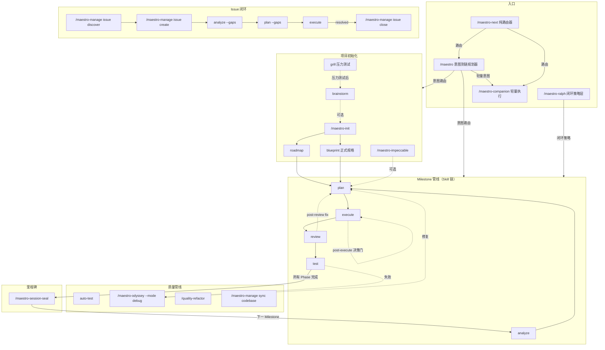
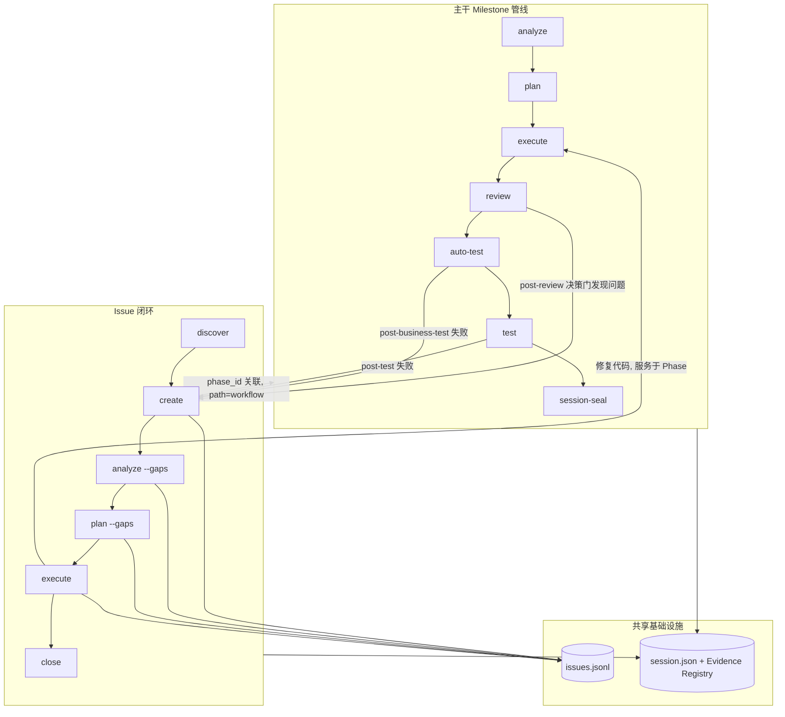

Maestro 命令系统包含 60+ 个 slash 命令，分为 10 大类。本文档提供命令全景图和核心工作流导航。

> **v0.5.56 编排模型**：Maestro 与 Ralph 合并为统一的 **canonical Session/Run 链协议**。`/maestro` 是**意图到链规划器**（intent → 初始 Skill 链 → `maestro session create --chain-file`），`/maestro-ralph` 是**闭环策略层**（Stage Mapping + decision gate + retry/drift/goal-audit）。`/maestro-next` 是**纯路由器**（分类意图 → 路由到 companion / 单 Run / `/maestro`），不再是规划器。旧的 `--engine swarm --script wf-*` 语法已全部退役。

## 命令总览

| 类别 | 命令数 | 前缀 | 职责 |
|------|--------|------|------|
| **核心编排** | 6 | `maestro-*` | `/maestro`（意图到链）、`/maestro-ralph`（闭环策略）、`/maestro-next`（路由）、`/maestro-companion`（轻量执行）、`/maestro-init`、`/maestro-session-seal` |
| **管理** | 13 | `manage-*` | Issue 生命周期、代码库文档、知识捕获、记忆管理、harvest、status、knowledge-audit |
| **质量** | 9 | `quality-*` / stage | 代码审查、业务测试、UAT、调试、重构、复盘、同步 |
| **Odyssey 深度循环** | 6 | `odyssey-*` | 长周期穷尽迭代——调试、改进、需求交付、审查修复、安全、UI 优化 |
| **规范** | 3 | `spec-*` | 项目规范初始化、加载、录入 |
| **学习** | 5 | `learn-*` | 统一复盘（git+决策）、跟读学习、模式拆解、系统探究、多视角分析 |
| **知识图谱** | 2 | `wiki-*` | 连接发现、知识摘要 |
| **团队智能** | 1 | `team-*` | ACO 蚁群智能、群体优化 |

全局入口 `/maestro` 是**意图到链规划器**，根据用户意图和项目状态自动选择最优命令链，创建 canonical Session 并进入共享 Run 循环。

---

## 命令全景图



> 图中裸命令名（`analyze`、`plan`、`execute`、`review`、`test`、`brainstorm`、`grill`、`blueprint`、`roadmap`、`auto-test`）是 **Skill 链步骤**，由 `/maestro` 路由或 `maestro session start --chain ...` 在 canonical Session 内执行；`maestro-*` 是独立 slash 命令。

---

## 主干与 Issue 的交互关系



### Issue 两种处理路径

| path | 含义 | 来源 | 生命周期 |
|------|------|------|----------|
| `standalone` | 独立 Issue，不绑定 Phase | 手动创建、`/maestro-manage issue discover`、外部导入 | 独立闭环，不影响 Phase 推进 |
| `workflow` | Phase 关联 Issue | `post-review` / `post-business-test` / `post-test` 决策门 auto-create、Phase 验证产生 | 可能阻塞 milestone 完成 |

---

## 一、主干工作流

### 项目初始化

```
/maestro-init → analyze（宏观）→ roadmap 或 blueprint（正式规格）
```

| 步骤 | 命令 | 作用 | 产出 |
|------|------|------|------|
| 0 | `brainstorm`（可选，经 `/maestro "brainstorm..."`） | 多角色头脑风暴 | guidance-specification.md |
| 0 | `grill`（可选，经 `/maestro "grill..."`） | 对抗式压力测试，验证方案假设 | context-package |
| 1 | `/maestro-init` | 初始化 .workflow/ 目录 | state.json, project.md, specs/ |
| 2 | `analyze "目标"`（宏观，经 `/maestro`） | 宏观分析——理解影响面 | context.md + scope_verdict |
| 3a | `roadmap`（scope_verdict=large 时） | 路线图 | roadmap.md (Milestone > Phase) |
| 3b | `blueprint`（经 `/maestro "<specification intent>"`） | 正式规格文档（7 阶段） | .workflow/blueprint/ |

### Milestone 管线

```
analyze → plan → execute → ◆post-execute → review → ◆post-review → test → ◆post-test → session-seal
```

| 阶段 | Skill 命令 | 产出 | Artifact |
|------|------|------|----------|
| 分析 | `analyze --session {session}` | context.md, analysis.md | ANL-{NNN} |
| 规划 | `plan --session {session}` | plan.json + TASK-*.json | PLN-{NNN} |
| 执行 | `execute --session {session}` | .summaries/, 代码变更 | EXC-{NNN} |
| 验证 | （内聚于 `post-execute` 决策门） | verification.json | VRF-{NNN} |
| 审查 | `review --session {session}` | review.json | REV-{NNN} |
| 测试 | `test --session {session}` | uat.md, test-results.json | TST-{NNN} |
| 封存 | `/maestro-session-seal` | 归档到 milestones/ | — |

每个 `◆` 是 Ralph 策略插入的 **decision 节点**，由只读 evaluator 评估并通过 `maestro session decide --verdict` 提交裁决（见 [Ralph 指南](./maestro-ralph-guide.md)）。

**Scope 路由**：无参数 = milestone 全量；数字 = 指定 phase；文本 = adhoc/standalone。`--from analyze:{id}` / `--from blueprint:{id}` 指定上游产物来源。

### 五种使用模式

**A. 全量模式**：`/maestro "实现 X"` → analyze → plan → execute → review → test（一步覆盖所有 phase）

**B. 逐 Phase**：`/maestro "analyze phase 1"` → `/maestro "plan phase 1"` → `/maestro "execute phase 1"`

**C. 混合模式**：全量分析 + 逐 phase 执行 + 中途 adhoc

**D. 统一规划**：analyze 1 → analyze 2 → plan → execute（分析后统一规划）

**E. 独立模式**：`analyze-plan-execute` 链（`/maestro "分析完直接改"`）——analyze -q → plan --dir → execute --dir，无需 init/roadmap

---

## 二、快速渠道

```bash
/maestro-next "修复登录页面 bug"        # 纯路由：分类意图 → 路由到 companion / 单 Run / /maestro
/maestro-next --list                    # 列出可路由渠道
/maestro-next --suggest "重构 API 层"   # 仅建议，不执行

/maestro-companion "修正 README 拼写"   # 轻量执行：最小 Run 生命周期（start + done）+ 证据记录
/maestro "实现用户认证功能"              # 意图到链：创建 canonical Session 并执行
/maestro-ralph "重构认证模块"           # 闭环策略：完整生命周期链 + decision gate

# CLI 直接建链（无需 slash 命令）
maestro session start "修复登录链路" --chain analyze plan execute review
maestro session start "理解认证流程" --session 20260721-learn-auth --chain learn --arg "src/auth"
```

> **`/maestro-next` 是纯路由器**：分类意图、评估复杂度，路由到正确执行渠道（`/maestro-companion` 轻量 / 标准单 Run / `/maestro` 多步），自身**不执行循环**，也**不作为链内步骤**出现。

---

## 三、Issue 闭环

```
发现 → 创建 → 分析 → 规划 → 执行 → 审查 → 关闭
```

```bash
/maestro-manage issue discover by-prompt "检查 API 的错误处理"
/maestro-manage issue create --title "内存泄漏" --severity high
/maestro "fix issue ISS-xxx"            # issue-full 链：analyze --gaps → plan --gaps → execute → review → close → harvest
/maestro-manage issue close ISS-xxx --resolution "Fixed"
```

`issue-full` 链（来自 `/maestro` 链目录）：

```
analyze --gaps {issue_id} → plan --gaps → execute → review → issue close {issue_id} → harvest --auto
```

`issue-quick` 快速路径：`plan --gaps → execute → issue close`。

---

## Odyssey 深度循环

> 穷尽迭代命令族——三句哲学约束：**零遗留** / **穷尽迭代** / **改进即标准**

与 Quality 管线（快速门控）不同，Odyssey 命令是长周期持久化会话，每个命令自带 fix→verify→generalize 闭环迭代，直到 0 remaining actionable 才退出。

```bash
/maestro-odyssey --mode debug "内存泄漏问题"                    # 考古→诊断→修复→泛化同类
/maestro-odyssey --mode improve "src/api/"                      # 6 维审计→逐轮修复→全部穷尽
/maestro-odyssey --mode planex "实现 JWT 刷新令牌"               # 需求→验收标准→迭代直到 ALL pass
/maestro-odyssey --mode review "src/auth/"                      # 深度审查→全 severity 修复→re-review
/maestro-odyssey --mode security "src/auth/"                    # OWASP Top 10 + STRIDE 安全审计
/maestro-odyssey --mode ui "src/components/Dashboard"           # 视觉普查→发散探索→穷尽打磨
```

| 命令 | 定位 | 对比 |
|------|------|------|
| `maestro-odyssey --mode debug` | 深度调试闭环（含考古、泛化） | vs `debug` 单步（快速诊断） |
| `maestro-odyssey --mode improve` | 运行质量深度提升 | vs `review` 决策门（通过/失败门控） |
| `maestro-odyssey --mode planex` | 需求到交付穷尽迭代 | vs `execute` 链步（按计划执行） |
| `maestro-odyssey --mode review` | 审查+修复+泛化全流程 | vs `review` 决策门（裁决不修复） |
| `maestro-odyssey --mode security` | 安全审计穷尽迭代 | vs `/security-audit`（单次审计） |
| `maestro-odyssey --mode ui` | UI 持久化打磨会话 | vs `/maestro-impeccable`（单次执行） |

**共用 flags**：`--skip-fix`（仅分析）· `--skip-generalize`（跳过泛化）· `-c`（恢复会话）· `--auto`（自动模式）· `-y`（自动确认）

---

## 四、质量管线

质量门由 Ralph 策略作为 **decision 节点**插入链中（`post-execute` / `post-business-test` / `post-review` / `post-test` / `post-frontend-verify`），由只读 evaluator 评估：

```bash
/maestro-ralph "实现 X"     # execute → ◆post-execute → review → ◆post-review → test → ◆post-test → seal
/maestro "全面质量检查"      # quality-loop 链：review → auto-test → test → debug → plan --gaps → execute
/maestro "review 有问题需要修"  # review-fix 链：plan --gaps → execute → review
/quality-refactor "auth module"  # 技术债务治理
```

| 命令 | 用途 | 关键参数 |
|------|------|----------|
| `review --session {session}` | 分层代码审查（链步） | `--tier quick` |
| `auto-test --session {session}` | 业务测试 / 测试生成（链步） | — |
| `test --session {session}` | 会话式 UAT（链步） | `--frontend-verify` |
| `/maestro-odyssey --mode debug` | 假设驱动调试 | `--from-uat {N}` `--parallel` |
| `/quality-refactor` | 技术债务治理 | `[scope]` |

**修复循环**：决策门 `fix` verdict → repair Skill 产生 `chain-proposal/1.0` → 插入修复 step（plan --gaps → execute）。详见 [Ralph 指南](./maestro-ralph-guide.md)。

---

## 五、协调器命令链（/maestro 链目录）

```bash
/maestro "实现用户认证模块"          # 意图分类 → 自动选择命令链 → 创建 Session
/maestro -y "添加 OAuth 支持"        # 自动确认低风险分类与 proposal
/maestro -c                          # 继续唯一 live 兼容 Session
/maestro --amend "改为支持 OAuth"    # 修改 live Session 目标
/maestro status                      # 项目仪表板
```

| 链名 | 命令序列 | 适用场景 |
|------|----------|----------|
| `full-lifecycle` | plan → execute → review → test → session-seal → harvest | 完整 milestone |
| `spec-driven` | init → roadmap --mode full → plan → execute → harvest | 从需求开始（重） |
| `roadmap-driven` | init → roadmap → plan → execute → harvest | 从需求开始（轻） |
| `blueprint-driven` | init → blueprint → plan → execute → harvest | 从想法/规格开始 |
| `brainstorm-driven` | brainstorm → plan → execute → harvest | 从探索开始 |
| `grill-driven` | grill → brainstorm --from grill → plan → execute → harvest | 压力测试后 |
| `analyze-plan-execute` | analyze -q → plan --dir → execute --dir → harvest | 快速通道（adhoc） |
| `quality-loop` | review → auto-test → test → debug → plan --gaps → execute | 质量修复 |
| `review-fix` | plan --gaps → execute → review | 修复 review 问题 |
| `issue-full` | analyze --gaps → plan --gaps → execute → review → close → harvest | Issue 闭环 |
| `milestone-close` | session-seal | 关闭里程碑 |
| `next-milestone` | roadmap → plan → execute | 下一里程碑 |
| `companion` | `/maestro-companion "<intent>"` | 即时小任务 |

> 完整链目录与意图分类规则见 `workflows/maestro.md`（Chain Catalog）。`/maestro` 是 decomposition owner（创建 boundary_contract + goals），下游 orchestrator 只消费不覆盖。

---

## 六、规范与知识

> **路由边界**（v0.5.50+）：`/maestro-spec` 管理项目约束规则（编码规范、架构约束、质量标准）；`/maestro-manage knowledge` 管理可复用知识文档（决策记录、操作配方、参考资料）。约束类走 `/maestro-spec add`，知识类走 `/maestro-manage knowledge capture`。

```bash
/maestro-spec setup                                      # 扫描项目生成规范
/maestro-spec add coding "所有 API 使用 Hono 框架"       # 录入约束规则
/maestro-spec load --role implement                     # 加载规范
/maestro-manage sync codebase                            # 增量刷新代码库文档
/maestro-manage knowledge knowhow search "认证"          # 搜索可复用知识
/maestro-manage knowledge audit --scope all             # 审计三存储，清理过期/矛盾条目
/maestro-manage status                                   # 项目仪表板
maestro search "认证"                                    # 统一知识搜索（wiki + code）
maestro load --category coding --keyword auth           # 统一知识加载
```

### 命令速查

| 命令 | 定位 | 使用场景 |
|------|------|----------|
| `/maestro` | 意图到链规划器 | 广泛意图路由；创建 canonical Session + 初始链；decomposition owner |
| `/maestro-ralph` | 闭环策略层 | 完整生命周期链 + decision gate + retry/drift/goal-audit |
| `/maestro-next` | 纯路由器 | 分类意图 → 路由到 companion / 单 Run / `/maestro`；不执行循环 |
| `/maestro-companion` | 轻量执行 | 机械清晰的小任务；最小 Run 生命周期（start + done）+ 证据 |
| `grill` | 压力测试 | 对抗式苏格拉底访谈，验证方案假设，产出 context-package |
| `blueprint` | 正式规格 | 7 阶段文档链（Brief → PRD → Architecture → Epics），与 brainstorm 互补 |
| `/maestro-manage knowledge audit` | 知识审计 | spec/knowhow/artifact 三存储审计淘汰（keep/deprecate/delete） |
| `/team-swarm` | 蚁群智能 | ACO 驱动群体优化，信息素收敛，4 角色 + Python 控制器 |
| `/maestro-odyssey --mode debug` | 深度调试 | 考古→诊断→修复→泛化，三句哲学约束穷尽迭代 |
| `/maestro-odyssey --mode improve` | 深度改进 | 6 维审计→逐轮修复→0 remaining actionable |
| `/maestro-odyssey --mode planex` | 需求交付 | 验收标准 ALL pass，不允许"接近通过" |
| `/maestro-odyssey --mode review` | 审查修复 | 全 severity 逐轮修复 + re-review gate |
| `/maestro-odyssey --mode security` | 安全审计 | OWASP Top 10 + STRIDE + 供应链分析 |
| `/maestro-odyssey --mode ui` | UI 深度优化 | 视觉普查→发散探索→穷尽打磨每个像素 |

---

## 专题指南

| 专题 | 指南 |
|------|------|
| Ralph 闭环引擎与协调器 | [Ralph Guide](./maestro-ralph-guide.md) |
| 质量管线详细说明 | [Quality Pipeline Guide](./quality-pipeline-guide.md) |
| Issue 发现与闭环 | [Issue Discover Guide](./issue-discover-guide.md) |
| 学习工具集 | [Learn Tools Guide](./learn-tools-guide.md) |
| 知识图谱管理 | [Knowledge Management Guide](./knowledge-management-guide.md) |
| CLI 命令参考 | [CLI Commands Guide](./cli-commands-guide.md) |
| 产物目录结构 | [Workflow Structure Guide](./workflow-structure-guide.md) |
| Spec 规范系统 | [Spec System Guide](./spec-system-guide.md) |
| Spec 注入机制 | [Spec Injection Guide](./spec-injection-guide.md) |
| MCP 工具参考 | [MCP Tools Guide](./mcp-tools-guide.md) |
| Delegate 异步委托 | [Delegate Async Guide](./delegate-async-guide.md) |
| Overlay 命令扩展 | [Overlay Guide](./overlay-guide.md) |
| Hooks 自动化 | [Hooks Guide](./hooks-guide.md) |

---

## 附录：辅助命令

工作流中用于维护、发布和规范管理的辅助命令。

### maestro-overlay --amend — 增量修改

信号驱动的 Overlay 生成器。从多种来源收集工作流缺陷信号，诊断哪些命令需要补充修改，批量生成针对性的 Overlay 补丁。所有修改通过 Overlay 系统（`~/.maestro/overlays/*.json`）完成——不侵入原始命令文件，幂等且重装后保留。

与 `/maestro-overlay`（单次显式创建）不同，`/maestro-overlay --amend` 通过分析工作流产物自动**发现**需要修复的内容。

#### 信号来源

| 标志 | 来源 | 采集内容 |
|------|------|---------|
| `--from-verify <dir>` | verification.json | 验证失败暴露的工作流缺口 |
| `--from-review <dir>` | review.json | 代码审查发现的流程缺陷 |
| `--from-session <id>` | 会话产物 | 执行期间遇到的问题 |
| `--from-issues ISS-xxx,...` | issues.jsonl | 追溯到命令缺陷的 Issue |
| `--scan` | 自动扫描 .workflow/ | 发现所有工作流相关信号 |
| _(位置参数文本)_ | 用户描述 | 直接观察和说明 |

```bash
/maestro-overlay --amend --from-verify .workflow/phases/1    # 从验证结果中发现命令缺口
/maestro-overlay --amend --scan                               # 自动扫描所有信号
/maestro-overlay --amend "execute 链步缺少 CLI 编译验证步骤"  # 直接描述问题
```

### maestro-update — 更新检查

检测当前 `.workflow/` 的 schema 版本，展示可用迁移计划，交互式执行版本升级。支持增量链式升级（如 1.0 → 2.0 → 3.0）。

```bash
/maestro-update --dry-run   # 检查是否有待执行的迁移
/maestro-update             # 交互式逐步升级
/maestro-update --force     # 一键全量升级
```

### maestro-spec remove — 规范移除

从 specs 文件中移除指定的 `<spec-entry>` 条目。Entry ID 格式：`spec-{file-stem}-{NNN}`。

```bash
maestro wiki list --type spec --json    # 列出所有 spec 条目
/maestro-spec remove spec-learnings-003          # 移除指定条目
```

### maestro-manage knowledge audit — 知识审计

审计 spec / knowhow / artifact 三存储，识别矛盾、过期、孤立和元数据质量问题。

| 标志 | 说明 |
|------|------|
| `--scope <spec\|knowhow\|artifact\|all>` | 审计范围（必需） |
| `--level P0\|P1\|P2` | 严重级别过滤 |
| `--dry-run` | 预览不修改 |
| `--report` | 仅生成审计报告 |

```bash
/maestro-manage knowledge audit --scope all              # 全量审计
/maestro-manage knowledge audit --scope spec --level P0  # 仅 P0 级 spec 问题
```

### 里程碑发布（/maestro-milestone-release 已退役）

> `/maestro-milestone-release` 已退役（v0.5.51）。发布请直接使用 npm CLI 执行 semver 版本提升与 git tag，或使用 `/maestro-update` 检查迁移。

```bash
npm version minor && git tag                  # 标准发布（minor 递增）
npm version patch && git tag                  # 补丁版本
npm version 2.0.0 && git tag v2.0.0            # 显式版本号
npm version --dry-run                          # 仅预览
```

里程碑生命周期：`/maestro-session-seal → 发布（npm version + tag / /maestro-update）`
